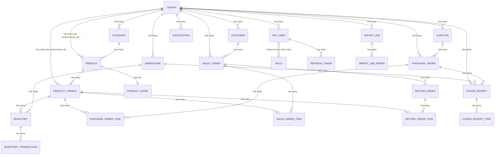

# Project Specification: Multi-Tenant Sales Management System

> **Purpose**: This document is a **language-agnostic, framework-agnostic** blueprint. Any developer or AI agent reading this file should be able to recreate a fully functional equivalent of this system in **any programming language or framework**.

---

## Table of Contents

1. [Product Vision & Overview](#1-product-vision--overview)
2. [Target Users & Roles](#2-target-users--roles)
3. [System Architecture Overview](#3-system-architecture-overview)
4. [Technology Stack (Reference Implementation)](#4-technology-stack-reference-implementation)
5. [Database Schema & Entity-Relationship Model](#5-database-schema--entity-relationship-model)
6. [Enumerations (Status Types)](#6-enumerations-status-types)
7. [Authentication & Authorization](#7-authentication--authorization)
8. [Multi-Tenancy Architecture](#8-multi-tenancy-architecture)
9. [API Specification (REST Endpoints)](#9-api-specification-rest-endpoints)
10. [Data Transfer Objects (DTOs)](#10-data-transfer-objects-dtos)
11. [Business Logic & Service Layer](#11-business-logic--service-layer)
12. [Caching Layer (Redis)](#12-caching-layer-redis)
13. [Data Seeding & Initialization](#13-data-seeding--initialization)
14. [Error Handling & Response Format](#14-error-handling--response-format)
15. [Configuration & Environment Variables](#15-configuration--environment-variables)
16. [Deployment (Docker)](#16-deployment-docker)
17. [Cross-Cutting Concerns](#17-cross-cutting-concerns)
18. [Appendix: Full Entity Field Specifications](#appendix-full-entity-field-specifications)

---

## 1. Product Vision & Overview

### What Is This?
A **multi-tenant SaaS backend API** for retail businesses to manage:
- **Sales** (orders, invoices, customer loyalty)
- **Inventory** (warehouses, stock levels, stock movements)
- **Purchasing** (purchase orders, goods receipts)
- **Returns** (return orders with refund calculations)
- **Products** (product catalog with variants, categories, images)
- **Users** (role-based access control per tenant)

### Key Architectural Principles
- **Multi-Tenant Logical Isolation**: All tenants share a single database, isolated via `tenant_id` foreign key on all tenant-scoped entities. Every data access is filtered by the authenticated user's tenant.
- **Stateless Authentication**: JWT access tokens + refresh token rotation.
- **Backend-Only API**: RESTful JSON API. No frontend/UI included.
- **RBAC**: Role-Based Access Control with method-level security.

---

## 2. Target Users & Roles

| Role | Scope | Permissions |
|------|-------|-------------|
| **ADMIN** | Global (no tenant) | Manage tenants, manage all users, assign roles, view all roles |
| **USER** | Tenant-scoped | Manage products, categories, customers, suppliers, warehouses, inventory, sales orders, purchase orders, goods receipts within their tenant |

### Role Authority Mapping
- Roles are stored as string names in the database (e.g., `ADMIN`, `USER`).
- In the security layer, roles are prefixed with `ROLE_` (e.g., `ROLE_ADMIN`, `ROLE_USER`).
- Users have a many-to-many relationship with roles via a join table `user_role`.
- **ADMIN users have `tenant = null`** (no tenant association) — they manage global platform resources.
- **USER users are always associated with exactly one tenant** — they can only access data belonging to their tenant.

---

## 3. System Architecture Overview

```
┌─────────────────────────────────────────────────────┐
│                  Client (Any HTTP Client)            │
└──────────────────────────┬──────────────────────────┘
                           │ HTTP/JSON
┌──────────────────────────▼──────────────────────────┐
│               REST API Layer (Controllers)           │
│  AuthController, TenantController, ProductController │
│  SalesOrderController, InventoryController, etc.     │
├──────────────────────────┬──────────────────────────┤
│            Security Filter Chain                     │
│  JWT Auth Filter → Extract Token → Set Tenant Context│
├──────────────────────────┬──────────────────────────┤
│            Service Layer (Business Logic)             │
│  AuthService, ProductService, SalesOrderService, etc.│
├──────────────────────────┬──────────────────────────┤
│            Data Access Layer (Repositories)           │
│  JPA/ORM Repositories with JPQL Queries              │
├──────────────────────────┬──────────────────────────┤
│            Database (SQL Server)                     │
│  + Redis (Caching Layer)                             │
└─────────────────────────────────────────────────────┘
```

---

## 4. Technology Stack (Reference Implementation)

> This section documents what the current implementation uses. **Replace with equivalents in your target stack.**

| Concern | Current Tech | Purpose |
|---------|-------------|---------|
| Language | Java 21 | Primary language |
| Framework | Spring Boot 3.5.15 | Web framework, DI, auto-configuration |
| ORM | Spring Data JPA / Hibernate | Database access, entity mapping |
| Database | Microsoft SQL Server 2022 | Primary datastore |
| Caching | Redis | Response caching with configurable TTL |
| Authentication | JWT (jjwt 0.12.6) | Stateless token-based auth |
| Password Hashing | BCrypt | Password encryption |
| API Documentation | SpringDoc OpenAPI 2.8.16 (Swagger UI) | Interactive API docs |
| Object Mapping | MapStruct 1.6.3 | Entity ↔ DTO conversion |
| Boilerplate Reduction | Lombok | Getters, setters, constructors |
| Validation | Jakarta Bean Validation | Request payload validation |
| Containerization | Docker + Docker Compose | Deployment |
| Build Tool | Maven | Dependency management, builds |

---

## 5. Database Schema & Entity-Relationship Model

### ER Diagram (Mermaid)



### Table Summaries

| Table | Primary Key Type | Tenant-Scoped? | Description |
|-------|-----------------|----------------|-------------|
| `tenant` | UUID (auto) | N/A | Root entity for multi-tenancy |
| `role` | UUID (auto) | No | Global roles (ADMIN, USER) |
| `user_role` | Composite (user_id + role_id) | No | Join table for user-role M:N |
| `app_user` | UUID (auto) | Yes (nullable for ADMIN) | System users |
| `refresh_token` | UUID (auto) | No (linked to user) | JWT refresh tokens |
| `category` | UUID (auto) | Yes | Product categories |
| `product` | UUID (auto) | Yes | Product master data |
| `product_image` | UUID (auto) | No (linked to product) | One image URL per product |
| `product_variant` | UUID (auto) | Yes | SKU-level product variants |
| `inventory` | UUID (auto) | No (linked to warehouse + variant) | Stock levels per warehouse-variant |
| `inventory_transaction` | UUID (auto) | No (linked to inventory) | Stock movement audit log |
| `customer` | UUID (auto) | Yes | Customer master data |
| `supplier` | UUID (auto) | Yes | Supplier/vendor master data |
| `warehouse` | UUID (auto) | Yes | Warehouse locations |
| `sales_order` | UUID (auto) | Yes | Sales order headers |
| `sales_order_item` | UUID (auto) | No (linked to sales_order) | Sales order line items |
| `purchase_order` | UUID (auto) | Yes | Purchase order headers |
| `purchase_order_item` | UUID (auto) | No (linked to PO) | Purchase order line items |
| `goods_receipt` | UUID (auto) | Yes | Goods receipt headers |
| `goods_receipt_item` | UUID (auto) | No (linked to GR) | Goods receipt line items |
| `return_order` | UUID (auto) | No (linked to sales_order) | Return order headers |
| `return_order_item` | UUID (auto) | No (linked to return_order) | Return order line items |
| `notification` | UUID (auto) | Yes | Tenant notifications |
| `import_job` | UUID (auto) | Yes | Bulk product import job tracking |
| `import_job_error` | BIGINT (auto-increment) | No (linked to import_job) | Import row-level errors |

### Database Indexes

| Table | Index Name | Columns | Purpose |
|-------|-----------|---------|---------|
| `product` | `idx_product_tenant_category` | `tenant_id, category_id` | Product listing by tenant+category |
| `product` | `idx_product_tenant_name` | `tenant_id, name` | Product search by tenant+name |
| `sales_order` | `idx_so_tenant` | `tenant_id` | Sales order listing by tenant |
| `purchase_order` | `idx_po_tenant` | `tenant_id` | Purchase order listing by tenant |
| `goods_receipt` | `idx_gr_tenant` | `tenant_id` | Goods receipt listing by tenant |

### Unique Constraints

| Table | Constraint Name | Columns | Purpose |
|-------|---------------|---------|---------|
| `tenant` | (column unique) | `code` | Unique tenant code |
| `app_user` | (column unique) | `email` | Unique user email |
| `product` | `uc_tenant_product_code` | `tenant_id, code` | Unique product code per tenant |
| `product_variant` | `uc_tenant_sku` | `tenant_id, sku` | Unique SKU per tenant |
| `sales_order` | (column unique) | `order_number` | Unique SO number globally |
| `purchase_order` | (column unique) | `po_number` | Unique PO number globally |
| `goods_receipt` | (column unique) | `receipt_number` | Unique GR number globally |
| `return_order` | (column unique) | `return_number` | Unique return number globally |
| `refresh_token` | (column unique) | `token` | Unique refresh token string |
| `role` | (column unique) | `name` | Unique role name |

### Check Constraints (Database-Level)

| Table | Column | Constraint |
|-------|--------|------------|
| `app_user` | `password` | `len([password]) >= 8` |
| `product_variant` | `cost_price` | `cost_price >= 0` |
| `product_variant` | `sell_price` | `sell_price >= 0` |
| `inventory` | `quantity` | `quantity >= 0` |
| `inventory_transaction` | `quantity` | `quantity >= 1` |
| `sales_order` | `subtotal` | `subtotal >= 0` |
| `sales_order` | `discount` | `discount >= 0` |
| `sales_order` | `total` | `total >= 0` |
| `sales_order_item` | `quantity` | `quantity >= 1` |
| `sales_order_item` | `unit_price` | `unit_price >= 0` |
| `sales_order_item` | `discount` | `discount >= 0` |
| `purchase_order` | `amount` | `amount >= 0` |
| `purchase_order_item` | `quantity` | `quantity >= 1` |
| `purchase_order_item` | `unit_cost` | `unit_cost >= 0` |
| `goods_receipt_item` | `quantity` | `quantity >= 1` |
| `return_order` | `total_refund` | `total_refund >= 0` |
| `return_order_item` | `quantity` | `quantity >= 1` |
| `customer` | `loyalty_point` | `loyalty_point >= 0` |
| `customer` | `total_spent` | `total_spent >= 0` |

---

## 6. Enumerations (Status Types)

```
TenantStatus:   ACTIVE | INACTIVE
UserStatus:     ACTIVE | INACTIVE
ProductStatus:  ACTIVE | INACTIVE
PurchaseStatus: PENDING | APPROVED | DELIVERY | RECEIVED | CANCELLED
TransactionType: IN | OUT
ImportJobStatus: PENDING | PROCESSING | COMPLETED | FAILED | CANCELLED
```

---

## 7. Authentication & Authorization

### 7.1 Authentication Flow

```
Login Flow:
1. Client POST /api/auth/login with { email, password }
2. Server checks IP-based rate limiter (5 attempts per 60-second sliding window)
3. If rate limit exceeded → 429 Too Many Requests
4. Server authenticates via AuthenticationManager (BCrypt password compare)
5. On success → generate JWT access token + create refresh token in DB
6. Return { accessToken, refreshToken }

Token Refresh Flow:
1. Client POST /api/auth/refresh with { refreshToken }
2. Server validates refresh token exists in DB and is not expired
3. If expired → delete ALL user's refresh tokens (security measure) → 401
4. Token Rotation: delete old token, create new one
5. Generate new JWT access token
6. Return { accessToken, refreshToken (new) }

Logout Flow:
1. Client POST /api/auth/logout with { refreshToken }
2. Server finds the refresh token, gets the user
3. Deletes ALL refresh tokens for that user
4. Returns 200 OK
```

### 7.2 JWT Token Structure

```json
{
  "sub": "user@email.com",         // Subject = user's email
  "tenantId": "uuid-string",       // Tenant ID (null for ADMIN)
  "iat": 1234567890,               // Issued at
  "exp": 1234568790                // Expiration
}
```

- **Algorithm**: HMAC-SHA (via jjwt library using Base64-decoded secret key)
- **Access Token Expiration**: 15 minutes (900,000 ms)
- **Refresh Token Expiration**: 7 days (604,800,000 ms)
- **Refresh Token Storage**: Database table `refresh_token`
- **Refresh Token Value**: UUID string (random)

### 7.3 JWT Authentication Filter (Per-Request)

```
For every HTTP request:
1. Extract "Authorization" header
2. If header starts with "Bearer ":
   a. Extract JWT from header (substring after "Bearer ")
   b. Extract email (subject) from JWT
   c. If email not null AND no authentication in SecurityContext:
      - Load UserDetails from database by email
      - Validate token (email match + not expired)
      - Set UsernamePasswordAuthenticationToken in SecurityContext
      - Extract tenantId from JWT → set in TenantContext (ThreadLocal)
3. Continue filter chain
4. Finally: clear TenantContext (ThreadLocal cleanup)
```

### 7.4 Security Configuration

- **CSRF**: Disabled (stateless API)
- **Session**: STATELESS (no HTTP sessions)
- **Public endpoints** (no auth required):
  - `/api/auth/**`
  - `/swagger-ui/**`
  - `/v3/api-docs/**`
- **All other endpoints**: Require authentication
- **Password Encoder**: BCrypt

### 7.5 Rate Limiting

- **Scope**: Login endpoint only
- **Strategy**: IP-based sliding window
- **Max Attempts**: 5 per 60-second window
- **Implementation**: In-memory `ConcurrentHashMap<String, Deque<Instant>>` (not distributed, per-instance only)

### 7.6 Method-Level Authorization

| Controller | Required Role | Notes |
|-----------|--------------|-------|
| TenantController (all methods) | ADMIN | Class-level `@PreAuthorize` |
| RoleController (all methods) | ADMIN | Class-level |
| AppUserController.createUser | ADMIN | |
| AppUserController.getAllUsers | ADMIN | |
| AppUserController.getUserById | Self OR ADMIN | `#id == authentication.principal.getId() or hasRole('ADMIN')` |
| AppUserController.updateUser | Self OR ADMIN | `#request.id() == authentication.principal.getId() or hasRole('ADMIN')` |
| AppUserController.activateUser | ADMIN | |
| AppUserController.deactivateUser | ADMIN | |
| AppUserController.assignRoles | ADMIN | |
| ProductController (all methods) | USER | Class-level |
| CategoryController (all methods) | USER | Class-level |
| CustomerController (all methods) | USER | Class-level |
| SupplierController (all methods) | USER | Class-level |
| WarehouseController (all methods) | USER | Class-level |
| InventoryController (all methods) | USER | Class-level |
| SalesOrderController (all methods) | USER | Class-level |
| PurchaseOrderController (all methods) | USER | Class-level |
| GoodsReceiptController (all methods) | USER | Class-level |
| ProductImportController (all methods) | ADMIN or STAFF or USER | |

### 7.7 Custom Error Responses

- **401 Unauthorized** (unauthenticated): JSON `{ timestamp, status: 401, error: "Unauthorized", message, path }`
- **403 Forbidden** (insufficient permissions): JSON `{ timestamp, status: 403, error: "Forbidden", message, path }`

---

## 8. Multi-Tenancy Architecture

### 8.1 Strategy: Shared Database, Logical Isolation via `tenant_id`

- All tenants share the same database and tables.
- Every tenant-scoped entity has a `tenant_id` foreign key column.
- All queries for tenant-scoped data MUST filter by the authenticated user's `tenant_id`.

### 8.2 Tenant Context Propagation

```
Request → JWT Filter → Extract tenantId from JWT → TenantContext.setTenantId(tenantId)
                                                     ↓
Service Layer → TenantSecurityUtil.getCurrentTenantId() → uses SecurityContext or TenantContext
                                                     ↓
                                                  finally → TenantContext.clear()
```

- **TenantContext**: Uses `ThreadLocal<UUID>` to store the current tenant ID per request.
- **TenantSecurityUtil.getCurrentTenantId()**: Reads tenant ID from the authenticated user's `AppUserDetails` (primary) or falls back to `TenantContext` (ThreadLocal).
- **TenantSecurityUtil.verifyTenantAccess(entityTenantId)**: Compares entity's tenant with current user's tenant; throws `AccessDeniedException` if mismatch.

### 8.3 Tenant Isolation in Services

Every service method that accesses tenant-scoped data follows this pattern:
1. Get `tenantId` from `TenantSecurityUtil.getCurrentTenantId()`.
2. Throw error if `tenantId` is null.
3. Query data using `tenantId` as filter (e.g., `findByTenantId(tenantId)`).
4. For single-entity access: fetch entity, then verify `entity.getTenant().getId().equals(tenantId)`.

---

## 9. API Specification (REST Endpoints)

### 9.1 Authentication (`/api/auth`)

| Method | Path | Auth | Request Body | Response Body | Status |
|--------|------|------|-------------|---------------|--------|
| POST | `/api/auth/login` | No | `LoginRequest` | `AuthResponse` | 200 |
| POST | `/api/auth/refresh` | No | `RefreshTokenRequest` | `AuthResponse` | 200 |
| POST | `/api/auth/logout` | No | `LogoutRequest` | (empty) | 200 |
| GET | `/api/auth/test` | No | (none) | `"Hello World!"` | 200 |

> **Note**: Registration endpoint (`/api/auth/register`) exists in code but is **commented out/disabled**. Users are created by ADMIN via `/api/app-user/create`.

### 9.2 Tenant Management (`/api/tenant`) — ADMIN only

| Method | Path | Request Body | Response Body | Status |
|--------|------|-------------|---------------|--------|
| POST | `/api/tenant/create` | `CreateTenantRequest` | `TenantResponse` | 201 |
| GET | `/api/tenant/get-all` | (none) | `List<TenantResponse>` | 200 |
| GET | `/api/tenant/{id}` | (none) | `TenantResponse` | 200 |
| PUT | `/api/tenant/{id}` | `CreateTenantRequest` | `TenantResponse` | 200 |
| DELETE | `/api/tenant/{id}` | (none) | (empty) | 204 |

### 9.3 User Management (`/api/app-user`)

| Method | Path | Auth | Request Body | Response Body | Status |
|--------|------|------|-------------|---------------|--------|
| POST | `/api/app-user/create` | ADMIN | `CreateAppUserRequest` | `AppUserResponse` | 201 |
| GET | `/api/app-user/get-all` | ADMIN | (none) | `List<AppUserResponse>` | 200 |
| GET | `/api/app-user/{id}` | Self or ADMIN | (none) | `AppUserResponse` | 200 |
| PUT | `/api/app-user/update` | Self or ADMIN | `UpdateAppUserRequest` | `AppUserResponse` | 200 |
| PUT | `/api/app-user/activate/{id}` | ADMIN | (none) | `AppUserResponse` | 200 |
| PUT | `/api/app-user/deactivate/{id}` | ADMIN | (none) | `AppUserResponse` | 200 |
| POST | `/api/app-user/assign-roles` | ADMIN | `AssignRolesRequest` | `AppUserResponse` | 200 |

### 9.4 Role Management (`/api/role`) — ADMIN only

| Method | Path | Response Body | Status |
|--------|------|---------------|--------|
| GET | `/api/role/get-all` | `List<RoleResponse>` | 200 |

### 9.5 Category Management (`/api/category`) — USER only

| Method | Path | Request Body | Response Body | Status | Query Params |
|--------|------|-------------|---------------|--------|-------------|
| POST | `/api/category/create` | `CreateCategoryRequest` | `CategoryResponse` | 201 | |
| GET | `/api/category` | (none) | `Page<CategoryResponse>` | 200 | `page, size, sortBy=name, direction=asc` |
| GET | `/api/category/{id}` | (none) | `CategoryResponse` | 200 | |
| PUT | `/api/category/{id}` | `CreateCategoryRequest` | `CategoryResponse` | 200 | |
| DELETE | `/api/category/{id}` | (none) | (empty) | 204 | |

### 9.6 Product Management (`/api/product`) — USER only

| Method | Path | Request Body | Response Body | Status | Query Params |
|--------|------|-------------|---------------|--------|-------------|
| POST | `/api/product/create` | `CreateProductRequest` | `ProductResponse` | 201 | |
| POST | `/api/product/import` | `List<CreateProductRequest>` | `List<ProductResponse>` | 201 | |
| GET | `/api/product` | (none) | `Page<ProductResponse>` | 200 | `categoryId?, name?, page=0, size=10, sortBy=name, direction=asc` |
| GET | `/api/product/{id}` | (none) | `ProductDetailResponse` | 200 | |
| PUT | `/api/product/{id}` | `CreateProductRequest` | `ProductResponse` | 200 | |
| DELETE | `/api/product/{id}` | (none) | (empty) | 204 | |

### 9.7 Product Import (`/api/import/products`)

| Method | Path | Request | Response Body | Status |
|--------|------|---------|---------------|--------|
| POST | `/api/import/products/start` | `multipart/form-data` (file) | `ImportJobResponse` | 202 |
| GET | `/api/import/products/jobs/{jobId}` | (none) | `ImportJobResponse` | 200 |
| POST | `/api/import/products/jobs/{jobId}/retry` | (none) | `ImportJobResponse` | 200 |
| GET | `/api/import/products/jobs/{jobId}/errors` | (none) | `List<ImportJobErrorResponse>` | 200 |

### 9.8 Customer Management (`/api/customer`) — USER only

| Method | Path | Request Body | Response Body | Status | Query Params |
|--------|------|-------------|---------------|--------|-------------|
| POST | `/api/customer/create` | `CreateCustomerRequest` | `CustomerResponse` | 201 | |
| GET | `/api/customer` | (none) | `Page<CustomerResponse>` | 200 | `page=0, size=10, sortBy=name, direction=asc` |
| GET | `/api/customer/{id}` | (none) | `CustomerResponse` | 200 | |
| PUT | `/api/customer/{id}` | `CreateCustomerRequest` | `CustomerResponse` | 200 | |
| DELETE | `/api/customer/{id}` | (none) | (empty) | 204 | |

### 9.9 Supplier Management (`/api/supplier`) — USER only

| Method | Path | Request Body | Response Body | Status | Query Params |
|--------|------|-------------|---------------|--------|-------------|
| POST | `/api/supplier/create` | `CreateSupplierRequest` | `SupplierResponse` | 201 | |
| GET | `/api/supplier` | (none) | `Page<SupplierResponse>` | 200 | `page=0, size=10, sortBy=name, direction=asc` |
| GET | `/api/supplier/{id}` | (none) | `SupplierResponse` | 200 | |
| PUT | `/api/supplier/{id}` | `CreateSupplierRequest` | `SupplierResponse` | 200 | |
| DELETE | `/api/supplier/{id}` | (none) | (empty) | 204 | |

### 9.10 Warehouse Management (`/api/warehouse`) — USER only

| Method | Path | Request Body | Response Body | Status | Query Params |
|--------|------|-------------|---------------|--------|-------------|
| POST | `/api/warehouse/create` | `CreateWarehouseRequest` | `WarehouseResponse` | 201 | |
| GET | `/api/warehouse` | (none) | `Page<WarehouseResponse>` | 200 | `page=0, size=10, sortBy=name, direction=asc` |
| GET | `/api/warehouse/{id}` | (none) | `WarehouseResponse` | 200 | |
| PUT | `/api/warehouse/{id}` | `CreateWarehouseRequest` | `WarehouseResponse` | 200 | |
| DELETE | `/api/warehouse/{id}` | (none) | (empty) | 204 | |

### 9.11 Inventory Management (`/api/inventory`) — USER only

| Method | Path | Request Body | Response Body | Status | Query Params |
|--------|------|-------------|---------------|--------|-------------|
| GET | `/api/inventory` | (none) | `Page<InventoryResponse>` | 200 | `warehouseId?, variantId?, query?, page=0, size=10, sortBy=quantity, direction=desc` |
| GET | `/api/inventory/stats` | (none) | `InventoryStatsResponse` | 200 | `warehouseId?, lowStockThreshold=5` |
| POST | `/api/inventory/adjust` | `AdjustInventoryRequest` | `InventoryResponse` | 200 | |
| GET | `/api/inventory/transactions` | (none) | `Page<InventoryTransactionResponse>` | 200 | `page=0, size=10, sortBy=id, direction=desc` |

### 9.12 Sales Order Management (`/api/sales-order`) — USER only

| Method | Path | Request Body | Response Body | Status | Query Params |
|--------|------|-------------|---------------|--------|-------------|
| POST | `/api/sales-order/create` | `CreateSalesOrderRequest` | `SalesOrderResponse` | 201 | |
| GET | `/api/sales-order` | (none) | `Page<SalesOrderResponse>` | 200 | `page=0, size=10, sortBy=createdAt, direction=desc` |
| GET | `/api/sales-order/{id}` | (none) | `SalesOrderResponse` | 200 | |
| PUT | `/api/sales-order/{id}` | `UpdateSalesOrderRequest` | `SalesOrderResponse` | 200 | |
| DELETE | `/api/sales-order/{id}` | (none) | (empty) | 204 | |

### 9.13 Purchase Order Management (`/api/purchase-order`) — USER only

| Method | Path | Request Body | Response Body | Status | Query Params |
|--------|------|-------------|---------------|--------|-------------|
| POST | `/api/purchase-order` | `CreatePurchaseOrderRequest` | `PurchaseOrderResponse` | 201 | |
| GET | `/api/purchase-order` | (none) | `Page<PurchaseOrderResponse>` | 200 | `page=0, size=10, sortBy=createdAt, direction=desc` |
| GET | `/api/purchase-order/{id}` | (none) | `PurchaseOrderResponse` | 200 | |
| PUT | `/api/purchase-order/{id}` | `CreatePurchaseOrderRequest` | `PurchaseOrderResponse` | 200 | |
| DELETE | `/api/purchase-order/{id}` | (none) | (empty) | 204 | |
| PATCH | `/api/purchase-order/{id}/status` | (none) | `PurchaseOrderResponse` | 200 | `status` (PurchaseStatus enum) |

### 9.14 Goods Receipt Management (`/api/goods-receipt`) — USER only

| Method | Path | Request Body | Response Body | Status | Query Params |
|--------|------|-------------|---------------|--------|-------------|
| POST | `/api/goods-receipt` | `CreateGoodsReceiptRequest` | `GoodsReceiptResponse` | 201 | |
| GET | `/api/goods-receipt` | (none) | `Page<GoodsReceiptResponse>` | 200 | `page=0, size=10, sortBy=receiptDate, direction=desc` |
| GET | `/api/goods-receipt/{id}` | (none) | `GoodsReceiptResponse` | 200 | |

---

## 10. Data Transfer Objects (DTOs)

### 10.1 Request DTOs

#### Authentication

```
LoginRequest {
  email: String
  password: String
}

RegisterRequest {
  email: String     @Email @NotBlank
  password: String  @NotBlank @Size(min=8)
  name: String      @NotBlank
  phone: String     @NotBlank
}

RefreshTokenRequest {
  refreshToken: String  @NotBlank
}

LogoutRequest {
  refreshToken: String  @NotBlank
}
```

#### Tenant

```
CreateTenantRequest {
  code: String  @NotBlank
  name: String  @NotBlank
}
```

#### User Management

```
CreateAppUserRequest {
  email: String       @Email @NotBlank
  password: String    @NotBlank @Size(min=8)
  name: String        @NotBlank
  phone: String       @NotBlank
  tenantId: UUID      @NotNull
  rolesId: List<UUID> @NotEmpty
}

UpdateAppUserRequest {
  id: UUID          @NotNull
  email: String     @Email @NotBlank
  name: String      @NotBlank
  phone: String     @NotBlank
}

AssignRolesRequest {
  id: UUID            @NotNull
  rolesId: List<UUID> @NotEmpty
}
```

#### Product

```
CreateProductRequest {
  code: String          @NotBlank
  name: String          @NotBlank
  description: String   (optional)
  imageUrl: String      (optional)
  categoryId: UUID      @NotNull
  sku: String           @NotBlank
  sellPrice: double     @Positive
  costPrice: double     @PositiveOrZero
}
```

#### Category

```
CreateCategoryRequest {
  name: String
}
```

#### Customer

```
CreateCustomerRequest {
  name: String     @NotBlank @Size(max=100)
  phone: String    @NotBlank @Size(max=20)
  email: String    @Email @Size(max=100) (optional)
  address: String  @Size(max=255) (optional)
}
```

#### Supplier

```
CreateSupplierRequest {
  code: String     @NotBlank @Size(max=50)
  name: String     @NotBlank @Size(max=100)
  phone: String    @NotBlank @Size(max=20)
  email: String    @Email @Size(max=100) (optional)
  address: String  @Size(max=255) (optional)
}
```

#### Warehouse

```
CreateWarehouseRequest {
  code: String     @NotBlank @Size(max=50)
  name: String     @NotBlank @Size(max=100)
  address: String  @Size(max=255) (optional)
}
```

#### Inventory

```
AdjustInventoryRequest {
  warehouseId: UUID          @NotNull
  variantId: UUID            @NotNull
  transactionType: Enum(IN|OUT) @NotNull
  quantity: int              @Min(1)
  referenceId: UUID          (optional)
}
```

#### Sales Order

```
CreateSalesOrderRequest {
  customerId: UUID
  warehouseId: UUID
  salesOrderItemRequests: List<CreateSalesOrderItemRequest>
}

CreateSalesOrderItemRequest {
  variantId: UUID
  quantity: int
  discount: double
}

UpdateSalesOrderRequest {
  customerId: UUID
  salesOrderItemRequests: List<CreateSalesOrderItemRequest>
}
```

#### Purchase Order

```
CreatePurchaseOrderRequest {
  supplierId: UUID
  items: List<CreatePurchaseOrderItemRequest>
}

CreatePurchaseOrderItemRequest {
  variantId: UUID
  quantity: int
  unitCost: double
}
```

#### Goods Receipt

```
CreateGoodsReceiptRequest {
  purchaseOrderId: UUID
  warehouseId: UUID
  items: List<CreateGoodsReceiptItemRequest>
}

CreateGoodsReceiptItemRequest {
  variantId: UUID
  quantity: int
}
```

### 10.2 Response DTOs

```
AuthResponse { accessToken: String, refreshToken: String }

TenantResponse { id: UUID, code: String, name: String, status: TenantStatus, createdAt: DateTime }

AppUserResponse { id: UUID, email: String, name: String, phone: String, status: UserStatus, createdAt: DateTime, tenantName: String, rolesName: List<String> }

RegisterResponse { id: UUID, email: String, name: String, phone: String, status: UserStatus, createdAt: DateTime, rolesName: List<String> }

RoleResponse { id: UUID, name: String, description: String }

CategoryResponse { id: UUID, name: String, tenantName: String }

ProductResponse { id: UUID, code: String, name: String, description: String, imageUrl: String, categoryName: String }

ProductDetailResponse { id: UUID, code: String, name: String, description: String, imageUrl: String, categoryName: String, currentInventory: int, price: double, sku: String }

CustomerResponse { id: UUID, name: String, phone: String, email: String, address: String, loyaltyPoint: double, totalSpent: double, tenantName: String }

SupplierResponse { id: UUID, code: String, name: String, phone: String, email: String, address: String, tenantName: String }

WarehouseResponse { id: UUID, code: String, name: String, address: String, tenantName: String }

InventoryResponse { inventoryId: UUID, warehouseId: UUID, warehouseName: String, productId: UUID, productName: String, variantId: UUID, sku: String, quantity: int, costPrice: double, sellPrice: double }

InventoryStatsResponse { totalItems: long, totalUniqueVariants: long, totalCostValue: double, totalSellValue: double, outOfStockCount: long, lowStockCount: long }

InventoryTransactionResponse { id: UUID, transactionType: TransactionType, quantity: int, inventoryId: UUID, warehouseId: UUID, warehouseName: String, variantId: UUID, sku: String, referenceId: UUID }

SalesOrderResponse { id: UUID, orderNumber: String, subtotal: double, discount: double, total: double, createdAt: DateTime, customerName: String, orderItems: List<SalesOrderItemResponse> }

SalesOrderItemResponse { id: UUID, quantity: int, unitPrice: double, discount: double, variantId: UUID, sku: String }

PurchaseOrderResponse { id: UUID, poNumber: String, status: String, amount: double, createdAt: DateTime, supplierName: String, items: List<PurchaseOrderItemResponse> }

PurchaseOrderItemResponse { id: UUID, variantId: UUID, sku: String, quantity: int, unitCost: double }

GoodsReceiptResponse { id: UUID, receiptNumber: String, receiptDate: DateTime, purchaseOrderId: UUID, poNumber: String, warehouseName: String, items: List<GoodsReceiptItemResponse> }

GoodsReceiptItemResponse { id: UUID, variantId: UUID, sku: String, quantity: int }

ImportJobResponse { id: UUID, status: String, totalRows: int, processedOffset: int, progressPercentage: double, createdAt: DateTime, updatedAt: DateTime }

ImportJobErrorResponse { id: Long, rowNumber: int, errorMessage: String, rawData: String }
```

---

## 11. Business Logic & Service Layer

### 11.1 Product Creation (`ProductService.createProduct`)

1. Get tenant ID from security context.
2. Fetch tenant entity by ID.
3. Fetch category by `categoryId`; verify it belongs to current tenant.
4. Create `Product` entity: code, name, description, status=ACTIVE, category, tenant.
5. Save product.
6. If `imageUrl` provided: create `ProductImage` entity linked to the saved product.
7. Create `ProductVariant` entity: sku, costPrice, sellPrice, status=ACTIVE, linked to product and tenant.
8. Map and return `ProductResponse`.

**Key Rule**: Each product is created with exactly **one default variant** (one SKU). The product code is unique per tenant; the SKU is unique per tenant.

### 11.2 Bulk Product Import (`ProductImportService`)

1. Accept a CSV/Excel file via multipart upload.
2. Create an `ImportJob` record with status=PROCESSING.
3. Parse file rows, batch lookup categories by name, batch lookup existing SKUs.
4. For each row: validate, create Product + ProductVariant, log errors to `ImportJobError`.
5. Use **batch save** for performance (collect entities, save in bulk).
6. Track `processedOffset` for resumability.
7. On failure: mark job as FAILED; support retry from `processedOffset`.

### 11.3 Sales Order Creation (`SalesOrderService.createSalesOrder`)

**This is the most complex business operation. Critical details:**

1. Get tenant ID from security context.
2. Validate customer belongs to current tenant.
3. Validate warehouse belongs to current tenant.
4. Generate order number: `"SO-" + System.currentTimeMillis()`.
5. Generate a UUID for the sales order BEFORE saving (needed for inventory transaction references).
6. **For each order item**:
   a. Validate variant belongs to current tenant.
   b. Find `Inventory` record for the specific warehouse + variant combination.
   c. **Atomic stock deduction**: Execute `UPDATE Inventory SET quantity = quantity - :qty WHERE id = :id AND quantity >= :qty`. If update affects 0 rows → throw "insufficient stock" error.
   d. Sync in-memory object state after deduction.
   e. Create `InventoryTransaction` with type=OUT, referenceId=salesOrderId.
   f. Create `SalesOrderItem` with unitPrice = variant's sellPrice.
7. Calculate totals:
   - `subtotal` = sum of (unitPrice × quantity) for all items
   - `discount` = sum of all item discounts
   - `total` = max(0, subtotal - discount)
8. Save sales order with cascade to items.

### 11.4 Sales Order Update (`SalesOrderService.updateSalesOrder`)

1. Verify tenant access.
2. **Revert previous stock**: For each old item, restore quantity to the first inventory record found for that variant.
3. Delete old `InventoryTransaction` records by referenceId (the order's ID).
4. Delete old `SalesOrderItem` records.
5. Re-validate customer.
6. **Process new items**: Same logic as creation but uses multi-warehouse deduction (spread deduction across multiple inventory records for the variant).
7. Recalculate totals.

### 11.5 Sales Order Deletion (`SalesOrderService.deleteSalesOrder`)

1. Verify tenant access.
2. Restore stock (add back quantities to first inventory found per variant).
3. Delete inventory transactions by referenceId.
4. Delete the sales order.

### 11.6 Goods Receipt Creation (`GoodsReceiptService.createGoodsReceipt`)

1. Validate purchase order, warehouse, and tenant.
2. Generate receipt number: `"GR-" + System.currentTimeMillis()`.
3. **For each receipt item**:
   a. Find or create `Inventory` record for warehouse + variant combination.
   b. Add received quantity to inventory.
   c. Create `InventoryTransaction` with type=IN.
4. Save goods receipt.

### 11.7 Inventory Adjustment (`InventoryService.adjustInventory`)

1. Validate warehouse and variant belong to current tenant.
2. Find or create inventory record for warehouse + variant.
3. If type=IN: add quantity.
4. If type=OUT: **Atomic deduction** (same as sales order); throw if insufficient.
5. Create `InventoryTransaction`.

### 11.8 Inventory Stats (`InventoryService.getInventoryStats`)

1. Query all inventory records for the current tenant (optionally filtered by warehouse).
2. Calculate:
   - `totalItems`: Sum of all quantities
   - `totalUniqueVariants`: Count of distinct inventory records
   - `totalCostValue`: Sum of (quantity × variant.costPrice)
   - `totalSellValue`: Sum of (quantity × variant.sellPrice)
   - `outOfStockCount`: Count of records where quantity = 0
   - `lowStockCount`: Count of records where 0 < quantity <= lowStockThreshold

### 11.9 Purchase Order Creation

1. Validate supplier and tenant.
2. Generate PO number: `"PO-" + System.currentTimeMillis()`.
3. Status defaults to PENDING.
4. Calculate `amount` = sum of (quantity × unitCost) for all items.
5. Save purchase order with items.

### 11.10 Purchase Order Status Update

- Accept a `PurchaseStatus` enum value and update the PO status.
- Valid transitions: PENDING → APPROVED → DELIVERY → RECEIVED → CANCELLED (no strict state machine enforced — any status can be set).

---

## 12. Caching Layer (Redis)

### Configuration
- **Host**: Configurable via `REDIS_HOST` env var (default: `localhost`)
- **Port**: Configurable via `REDIS_PORT` env var (default: `6379`)
- **Default TTL**: 3600 seconds (1 hour), configurable via `app.cache.ttl`
- **Serialization**: JSON (using `GenericJackson2JsonRedisSerializer` with Spring Data Page support)
- **Null Values**: Caching of null values is disabled

### Cache Usage Pattern
- Uses Spring `@Cacheable`, `@CacheEvict`, `@CachePut` annotations on service methods.
- Redis is used as a distributed cache for paginated query results.

---

## 13. Data Seeding & Initialization

On application startup (via `CommandLineRunner`), the following seed data is created **if not already present**:

### Roles
| Name | Description |
|------|------------|
| ADMIN | Administrator Role |
| USER | Standard User Role |

### Default Tenant
| Code | Name |
|------|------|
| TS1 | Tenant Store 1 |

### Default Users

| Email | Password (plain) | Name | Phone | Status | Tenant | Roles |
|-------|-----------------|------|-------|--------|--------|-------|
| admin@gmail.com | admin123 | Administrator | 0123456789 | ACTIVE | null (no tenant) | ADMIN |
| user@gmail.com | user1234 | User | 0123456788 | ACTIVE | TS1 | USER |

---

## 14. Error Handling & Response Format

### Global Exception Handler

All errors return JSON with the following structure:

```json
{
  "timestamp": "2024-01-01T12:00:00.000",
  "status": 400,
  "error": "Error Type",
  "message": "Human-readable error message",
  "details": { ... }  // Only for validation errors
}
```

### Exception Mapping

| Exception | HTTP Status | Error Label |
|-----------|------------|-------------|
| `MethodArgumentNotValidException` | 400 Bad Request | "Validation Failed" (includes field-level `details` map) |
| `ConstraintViolationException` | 400 Bad Request | "Validation Failed" |
| `EmailAlreadyExistsException` | 409 Conflict | "Email Already Exists" |
| `InvalidRefreshTokenException` | 401 Unauthorized | "Invalid Refresh Token" |
| `RateLimitExceededException` | 429 Too Many Requests | "Too Many Requests" |
| `AuthenticationException` | 401 Unauthorized | "Unauthorized" |
| `RuntimeException` (catch-all) | 400 Bad Request | "Bad Request" |

### Custom Exception Classes

```
EmailAlreadyExistsException extends RuntimeException
InvalidRefreshTokenException extends RuntimeException
RateLimitExceededException extends RuntimeException
```

---

## 15. Configuration & Environment Variables

### Application Configuration (application.properties)

```properties
spring.application.name=SalesManagement

# Database (SQL Server)
spring.datasource.url=jdbc:sqlserver://<host>:1433;databaseName=${DB_NAME:sales};encrypt=true;trustServerCertificate=true
spring.datasource.username=${DB_USERNAME:sa}
spring.datasource.password=${SA_PASSWORD:default}

# JPA/Hibernate
spring.jpa.database-platform=org.hibernate.dialect.SQLServerDialect
spring.jpa.hibernate.ddl-auto=update    # Auto-creates/updates tables
spring.jpa.show-sql=true
spring.jpa.properties.hibernate.format_sql=true

# JWT
jwt.secret-key=${JWT_SECRET_KEY:<base64-encoded-secret>}
jwt.expiration=900000          # 15 minutes in ms
jwt.refresh-expiration=604800000  # 7 days in ms

# Redis
spring.data.redis.host=${REDIS_HOST:localhost}
spring.data.redis.port=${REDIS_PORT:6379}
app.cache.ttl=3600             # Cache TTL in seconds

# Proxy/Load Balancer
server.forward-headers-strategy=framework
```

### Environment Variables

| Variable | Required | Default | Description |
|----------|---------|---------|-------------|
| `DB_USERNAME` | Yes | `sa` | Database username |
| `SA_PASSWORD` / `DB_PASSWORD` | Yes | — | Database password |
| `DB_NAME` | No | `sales` | Database name |
| `JWT_SECRET_KEY` | Yes | — | Base64-encoded HMAC secret key for JWT signing |
| `REDIS_HOST` | No | `localhost` | Redis server host |
| `REDIS_PORT` | No | `6379` | Redis server port |
| `SPRING_PORT` | No | `8080` | Application port (Docker mapping) |

---

## 16. Deployment (Docker)

### Dockerfile

```dockerfile
FROM eclipse-temurin:21-jre
WORKDIR /app
COPY target/*.jar app.jar
RUN addgroup --system spring && adduser --system spring --ingroup spring
USER spring
EXPOSE 8080
ENTRYPOINT ["java", "-jar", "app.jar"]
```

### Docker Compose Services

| Service | Image | Purpose |
|---------|-------|---------|
| `sqlserver` | `mcr.microsoft.com/mssql/server:2022-latest` | SQL Server database |
| `db-init` | Same SQL Server image | One-shot init: creates the database if not exists |
| `app` | Built from Dockerfile | The Spring Boot application |

### Docker Compose Startup Order

1. `sqlserver` starts with healthcheck (polls `SELECT 1` every 10s, 10 retries).
2. `db-init` waits for `sqlserver` to be healthy, then runs `init-db.sh` to create the database.
3. `app` waits for `db-init` to complete successfully, then starts.

### init-db.sh Script

```bash
#!/bin/bash
sleep 20
sqlcmd -S sqlserver -U ${DB_USERNAME:-sa} -P ${SA_PASSWORD} -C \
  -Q "IF DB_ID('${DB_NAME:-sales}') IS NULL CREATE DATABASE ${DB_NAME:-sales}"
```

---

## 17. Cross-Cutting Concerns

### 17.1 CORS

- **Allowed Origins**: `*` (all origins)
- **Allowed Methods**: All (default from Spring CORS)
- Applied globally via `WebMvcConfigurer`.

### 17.2 API Documentation (Swagger/OpenAPI)

- **Path**: `/swagger-ui/index.html`
- **API Docs**: `/v3/api-docs`
- **Security**: Bearer token authentication scheme configured for all endpoints.
- **Title**: "Sales Management Api"
- **Version**: "1.0"

### 17.3 Pagination

All list endpoints use Spring Data `Pageable` with the following standard query parameters:
- `page` (int, 0-indexed, default: 0)
- `size` (int, default: 10)
- `sortBy` (String, default varies per endpoint)
- `direction` (String: "asc" or "desc", default varies)

Response format is Spring Page wrapper:
```json
{
  "content": [...],
  "pageable": { ... },
  "totalPages": 5,
  "totalElements": 50,
  "size": 10,
  "number": 0,
  ...
}
```

### 17.4 Timestamp Handling

- All `createdAt` fields use `@CreationTimestamp` — auto-set on insert, `updatable = false`.
- All `updatedAt` fields use `@UpdateTimestamp` — auto-set on insert and update.
- Type: `LocalDateTime` for most timestamps, `Instant` for refresh token timestamps.

### 17.5 ID Generation

- All entities use `UUID` primary keys with auto-generation strategy (`GenerationType.UUID`).
- Exception: `ImportJobError` uses `BIGINT` / `GenerationType.IDENTITY` (auto-increment).

### 17.6 Entity-DTO Mapping

- All mapping is done via dedicated Mapper interfaces/classes.
- Pattern: `EntityMapper.toResponse(entity)` → response DTO.
- Maps nested entity names (e.g., `tenant.name` → `tenantName`, `category.name` → `categoryName`).
- Maps role names from `user.roles.stream().map(Role::getName).toList()` → `rolesName`.

---

## Appendix: Full Entity Field Specifications

### Tenant

| Field | Type | DB Column | Constraints | Default | Notes |
|-------|------|-----------|-------------|---------|-------|
| id | UUID | PK, auto-generated | | | |
| code | String | `varchar(50)`, UNIQUE, NOT NULL | @NotBlank @Size(max=50) | | |
| name | String | `nvarchar(100)`, NOT NULL | @NotBlank @Size(max=100) | | Unicode support |
| status | TenantStatus | `varchar(50)`, NOT NULL | @NotNull | ACTIVE | |
| createdAt | LocalDateTime | NOT NULL, not updatable | @CreationTimestamp | auto | |

**Relationships**: OneToMany → AppUser, Category, Supplier, Customer, WareHouse, Notification

---

### AppUser

| Field | Type | DB Column | Constraints | Default | Notes |
|-------|------|-----------|-------------|---------|-------|
| id | UUID | PK, auto-generated | | | |
| email | String | `varchar(100)`, UNIQUE, NOT NULL | @Email @NotBlank @Size(max=100) | | Used as username |
| password | String | `varchar(100)`, NOT NULL | @NotBlank @Size(min=8, max=100) | | BCrypt hashed. DB check: `len >= 8` |
| name | String | `nvarchar(100)`, NOT NULL | @NotBlank @Size(max=100) | | Unicode |
| phone | String | `char(10)`, NOT NULL | @NotBlank @Size(min=10, max=10) | | Fixed 10 chars |
| status | UserStatus | `varchar(50)`, NOT NULL | @NotNull | ACTIVE | |
| createdAt | LocalDateTime | NOT NULL, not updatable | @CreationTimestamp | auto | |

**Relationships**: ManyToOne → Tenant (EAGER, nullable for ADMIN); ManyToMany → Role (EAGER, via `user_role` join table)

---

### Role

| Field | Type | DB Column | Constraints | Default |
|-------|------|-----------|-------------|---------|
| id | UUID | PK, auto-generated | | |
| name | String | `varchar(50)`, UNIQUE, NOT NULL | @NotBlank @Size(max=50) | |
| description | String | `nvarchar(255)` | @Size(max=255) | null |

**Relationships**: ManyToMany (inverse) → AppUser (LAZY)

---

### RefreshToken

| Field | Type | DB Column | Constraints |
|-------|------|-----------|-------------|
| id | UUID | PK, auto-generated | |
| token | String | UNIQUE, NOT NULL | |
| expiryDate | Instant | NOT NULL | |
| createdAt | Instant | NOT NULL, not updatable | @CreationTimestamp + @PrePersist |

**Relationships**: ManyToOne → AppUser (LAZY)

---

### Category

| Field | Type | DB Column | Constraints |
|-------|------|-----------|-------------|
| id | UUID | PK, auto-generated | |
| name | String | `nvarchar(100)`, NOT NULL | @NotBlank @Size(max=100) |

**Relationships**: ManyToOne → Tenant (EAGER, NOT NULL); OneToMany → Product

---

### Product

| Field | Type | DB Column | Constraints | Default |
|-------|------|-----------|-------------|---------|
| id | UUID | PK, auto-generated | | |
| code | String | `varchar(50)`, NOT NULL | @NotBlank @Size(max=50) | |
| name | String | `nvarchar(150)`, NOT NULL | @NotBlank @Size(max=150) | |
| description | String | `nvarchar(1000)` | @Size(max=1000) | null |
| status | ProductStatus | `varchar(50)`, NOT NULL | @NotNull | ACTIVE |

**Relationships**: OneToOne → ProductImage (mapped, CASCADE ALL, EAGER); ManyToOne → Category (EAGER, NOT NULL); ManyToOne → Tenant (EAGER, NOT NULL); OneToMany → ProductVariant

---

### ProductImage

| Field | Type | DB Column | Constraints |
|-------|------|-----------|-------------|
| id | UUID | PK, auto-generated | |
| imageUrl | String | `varchar(255)`, NOT NULL | @NotBlank @Size(max=255) |

**Relationships**: OneToOne → Product (NOT NULL)

---

### ProductVariant

| Field | Type | DB Column | Constraints | Default |
|-------|------|-----------|-------------|---------|
| id | UUID | PK, auto-generated | | |
| sku | String | `varchar(50)`, NOT NULL | @NotBlank @Size(max=50) | |
| barcode | String | `varchar(50)` | @Size(max=50) | null |
| costPrice | double | `float`, NOT NULL | @Min(0), CHECK >= 0 | |
| sellPrice | double | `float`, NOT NULL | @Min(0), CHECK >= 0 | |
| status | ProductStatus | `varchar(50)`, NOT NULL | @NotNull | ACTIVE |

**Relationships**: ManyToOne → Product (EAGER, NOT NULL); ManyToOne → Tenant (EAGER, NOT NULL); OneToMany → Inventory, PurchaseOrderItem, SalesOrderItem, ReturnOrderItem

---

### Inventory

| Field | Type | DB Column | Constraints |
|-------|------|-----------|-------------|
| id | UUID | PK, auto-generated | |
| quantity | int | `int`, NOT NULL | @Min(0), CHECK >= 0 |

**Relationships**: ManyToOne → WareHouse (EAGER, NOT NULL); ManyToOne → ProductVariant (EAGER, NOT NULL); OneToMany → InventoryTransaction (LAZY)

---

### InventoryTransaction

| Field | Type | DB Column | Constraints |
|-------|------|-----------|-------------|
| id | UUID | PK, auto-generated | |
| transactionType | TransactionType | `varchar(50)`, NOT NULL | @NotNull |
| quantity | int | `int`, NOT NULL | @Min(1), CHECK >= 1 |
| referenceId | UUID | NOT NULL | @NotNull — stores the ID of the related document (SalesOrder, GoodsReceipt, etc.) |

**Relationships**: ManyToOne → Inventory (EAGER, NOT NULL)

---

### Customer

| Field | Type | DB Column | Constraints | Default |
|-------|------|-----------|-------------|---------|
| id | UUID | PK, auto-generated | | |
| name | String | `nvarchar(100)`, NOT NULL | @NotBlank @Size(max=100) | |
| phone | String | `varchar(20)`, NOT NULL | @NotBlank @Size(max=20) | |
| email | String | `varchar(100)` | @Email @Size(max=100) | null |
| address | String | `nvarchar(255)` | @Size(max=255) | null |
| loyaltyPoint | double | `float`, NOT NULL | @Min(0), CHECK >= 0 | 0.0 |
| totalSpent | double | `float`, NOT NULL | @Min(0), CHECK >= 0 | 0.0 |

**Relationships**: ManyToOne → Tenant (EAGER, NOT NULL); OneToMany → SalesOrder (LAZY)

---

### Supplier

| Field | Type | DB Column | Constraints |
|-------|------|-----------|-------------|
| id | UUID | PK, auto-generated | |
| code | String | `varchar(50)`, NOT NULL | @NotBlank @Size(max=50) |
| name | String | `nvarchar(100)`, NOT NULL | @NotBlank @Size(max=100) |
| phone | String | `varchar(20)`, NOT NULL | @NotBlank @Size(max=20) |
| email | String | `varchar(100)` | @Email @Size(max=100) |
| address | String | `nvarchar(255)` | @Size(max=255) |

**Relationships**: ManyToOne → Tenant (EAGER, NOT NULL); OneToMany → PurchaseOrder (LAZY)

---

### WareHouse

| Field | Type | DB Column | Constraints |
|-------|------|-----------|-------------|
| id | UUID | PK, auto-generated | |
| code | String | `varchar(50)`, NOT NULL | @NotBlank @Size(max=50) |
| name | String | `nvarchar(100)`, NOT NULL | @NotBlank @Size(max=100) |
| address | String | `nvarchar(255)` | @Size(max=255) |

**Relationships**: ManyToOne → Tenant (EAGER, NOT NULL); OneToMany → GoodsReceipt (LAZY); OneToMany → Inventory (LAZY)

---

### SalesOrder

| Field | Type | DB Column | Constraints |
|-------|------|-----------|-------------|
| id | UUID | PK, auto-generated | |
| orderNumber | String | `varchar(50)`, UNIQUE, NOT NULL | @NotBlank @Size(max=50) |
| subtotal | double | `float`, NOT NULL | @Min(0), CHECK >= 0 |
| discount | double | `float`, NOT NULL | @Min(0), CHECK >= 0 |
| total | double | `float`, NOT NULL | @Min(0), CHECK >= 0 |
| createdAt | LocalDateTime | not updatable | @CreationTimestamp |

**Relationships**: ManyToOne → Customer (EAGER, NOT NULL); ManyToOne → Tenant (EAGER, NOT NULL); OneToMany → SalesOrderItem (EAGER, CASCADE ALL); OneToMany → ReturnOrder (LAZY)

---

### SalesOrderItem

| Field | Type | DB Column | Constraints |
|-------|------|-----------|-------------|
| id | UUID | PK, auto-generated | |
| quantity | int | `int`, NOT NULL | @Min(1), CHECK >= 1 |
| unitPrice | double | `float`, NOT NULL | @Min(0), CHECK >= 0 |
| discount | double | `float`, NOT NULL | @Min(0), CHECK >= 0 |

**Relationships**: ManyToOne → SalesOrder (EAGER, NOT NULL, FK: `so_id`); ManyToOne → ProductVariant (EAGER, NOT NULL)

---

### PurchaseOrder

| Field | Type | DB Column | Constraints | Default |
|-------|------|-----------|-------------|---------|
| id | UUID | PK, auto-generated | | |
| poNumber | String | `varchar(50)`, UNIQUE, NOT NULL | @NotBlank @Size(max=50) | |
| status | PurchaseStatus | `varchar(50)`, NOT NULL | @NotNull | PENDING |
| amount | double | `float`, NOT NULL | @Min(0), CHECK >= 0 | |
| createdAt | LocalDateTime | not updatable | @CreationTimestamp | |

**Relationships**: ManyToOne → Tenant (EAGER, NOT NULL); ManyToOne → Supplier (EAGER, NOT NULL); OneToMany → PurchaseOrderItem (EAGER); OneToMany → GoodsReceipt (EAGER)

---

### PurchaseOrderItem

| Field | Type | DB Column | Constraints |
|-------|------|-----------|-------------|
| id | UUID | PK, auto-generated | |
| quantity | int | `int`, NOT NULL | @Min(1), CHECK >= 1 |
| unitCost | double | `float`, NOT NULL | @Min(0), CHECK >= 0 |

**Relationships**: ManyToOne → ProductVariant (EAGER, NOT NULL); ManyToOne → PurchaseOrder (EAGER, NOT NULL, FK: `po_id`)

---

### GoodsReceipt

| Field | Type | DB Column | Constraints |
|-------|------|-----------|-------------|
| id | UUID | PK, auto-generated | |
| receiptNumber | String | `varchar(50)`, UNIQUE, NOT NULL | @NotBlank @Size(max=50) |
| receiptDate | LocalDateTime | not updatable | @CreationTimestamp |

**Relationships**: ManyToOne → Tenant (EAGER, NOT NULL); ManyToOne → PurchaseOrder (EAGER, NOT NULL, FK: `po_id`); ManyToOne → WareHouse (EAGER, NOT NULL); OneToMany → GoodsReceiptItem (EAGER)

---

### GoodsReceiptItem

| Field | Type | DB Column | Constraints |
|-------|------|-----------|-------------|
| id | UUID | PK, auto-generated | |
| quantity | int | `int`, NOT NULL | @Min(1), CHECK >= 1 |

**Relationships**: ManyToOne → GoodsReceipt (EAGER, NOT NULL); ManyToOne → ProductVariant (EAGER, NOT NULL)

---

### ReturnOrder

| Field | Type | DB Column | Constraints |
|-------|------|-----------|-------------|
| id | UUID | PK, auto-generated | |
| returnNumber | String | `varchar(50)`, UNIQUE, NOT NULL | @NotBlank @Size(max=50) |
| reason | String | `nvarchar(max)`, NOT NULL | @NotBlank |
| totalRefund | double | `float`, NOT NULL | @Min(0), CHECK >= 0 |
| returnDate | LocalDateTime | not updatable | @CreationTimestamp |

**Relationships**: ManyToOne → SalesOrder (EAGER, NOT NULL, FK: `so_id`); OneToMany → ReturnOrderItem (EAGER)

---

### ReturnOrderItem

| Field | Type | DB Column | Constraints |
|-------|------|-----------|-------------|
| id | UUID | PK, auto-generated | |
| quantity | int | `int`, NOT NULL | @Min(1), CHECK >= 1 |

**Relationships**: ManyToOne → ReturnOrder (EAGER, NOT NULL, FK: `ro_id`); ManyToOne → ProductVariant (EAGER, NOT NULL)

---

### Notification

| Field | Type | DB Column | Constraints | Default |
|-------|------|-----------|-------------|---------|
| id | UUID | PK, auto-generated | | |
| title | String | `nvarchar(150)`, NOT NULL | @NotBlank @Size(max=150) | |
| content | String | `nvarchar(max)`, NOT NULL | @NotBlank | |
| isRead | boolean | `bit` | | false (default 0) |

**Relationships**: ManyToOne → Tenant (LAZY, NOT NULL)

---

### ImportJob

| Field | Type | DB Column | Constraints | Default |
|-------|------|-----------|-------------|---------|
| id | UUID | PK, auto-generated | | |
| filePath | String | `nvarchar(500)`, NOT NULL | @NotNull | |
| status | ImportJobStatus | `varchar(50)`, NOT NULL | @NotNull | PENDING |
| totalRows | int | NOT NULL | | 0 |
| processedOffset | int | NOT NULL | | 0 |
| createdAt | LocalDateTime | NOT NULL, not updatable | @CreationTimestamp | |
| updatedAt | LocalDateTime | NOT NULL | @UpdateTimestamp | |

**Relationships**: ManyToOne → Tenant (LAZY, NOT NULL)

---

### ImportJobError

| Field | Type | DB Column | Constraints |
|-------|------|-----------|-------------|
| id | Long | PK, auto-increment (IDENTITY) | |
| rowNumber | int | NOT NULL | |
| errorMessage | String | `nvarchar(1000)` | |
| rawData | String | `nvarchar(max)` | |

**Relationships**: ManyToOne → ImportJob (LAZY, NOT NULL, FK: `job_id`)

---

### Custom Repository Queries (Important)

#### InventoryRepository

```sql
-- Sum quantity across all warehouses for a product
SELECT COALESCE(SUM(i.quantity), 0) FROM Inventory i WHERE i.variant.product.id = :productId

-- Sum quantity across all warehouses for a variant
SELECT COALESCE(SUM(i.quantity), 0) FROM Inventory i WHERE i.variant.id = :variantId

-- Atomic stock deduction (prevents race conditions)
UPDATE Inventory i SET i.quantity = i.quantity - :quantity WHERE i.id = :id AND i.quantity >= :quantity

-- Filtered inventory listing
SELECT i FROM Inventory i WHERE i.warehouse.tenant.id = :tenantId
  AND (:warehouseId IS NULL OR i.warehouse.id = :warehouseId)
  AND (:variantId IS NULL OR i.variant.id = :variantId)
  AND (:query IS NULL OR i.variant.sku LIKE %:query% OR i.variant.product.name LIKE %:query%)

-- Check if warehouse has inventory
SELECT EXISTS(...) FROM Inventory WHERE warehouse.id = :warehouseId
```

#### InventoryTransactionRepository

```sql
-- Delete all transactions referencing a specific document
DELETE FROM InventoryTransaction WHERE referenceId = :referenceId
```

---

> **End of Specification**. This document contains all information necessary to recreate the Multi-Tenant Sales Management System in any language or framework.
